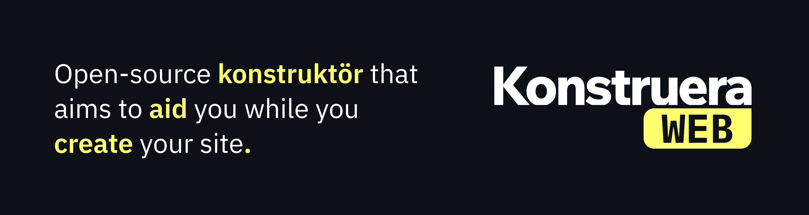

# Konstruera: Site builder..?


Konstruera is a tool created by me to aid me build [notalternate.github.io](https://notalternate.github.io).
However sharing is caring, so this tool is open-source I guess..

<p align="center"></p>

*Banner of Konstruera's short description and logo.*

## Prerequisites

If you are running a Windows NT system, WSL (Windows Subsystem for Linux) is recommended.
Although Konstruera should work in NT systems, it is not tested.<br>
However, if you are using MacOS or (any) Linux (distro), you can continue the installation process.

\* It is recommended to install the Rust programming language via ([Rustup](https://rustup.rs))

- Rust programming language
    - Try configuring your current shell to include Cargo's binaries in the `PATH` variable (if it wasn't automatically included by `rustup`) by including the following:
      `export PATH="$PATH:$HOME/.cargo/bin"`
      In your shell's configuration.
- `git` or `gh` ([Github CLI](https://cli.github.com/)) <br> *\* not required if you download the repository via Web or Desktop*

## Installation (unstable)

Currently, there are no stable releases of Konstruera, cloning the repository directly will give you the in-development or unstable version.
Proceed if you are alright with it.

#### CLONING, BUILDING AND INSTALLING

1. Clone the repository via any option in the "**<> Code**" tab, which can be found on the top of the GitHub repository's page.
2. Run the following command in the `./Konstruera/` directory (The cloned repository, replace if you cloned under a different name).
```sh
$ cargo build --release; cargo install --path .
```
3. Konstruera should be compiled as an executable inside the `./target/release/` directory and installed to your Cargo binaries.

## Contributing

You can support the project by contributing to it via forking the repository, commit changes and opening up a pull request (Instructions on how to fork it can be read [here](https://docs.github.com/en/get-started/quickstart/contributing-to-projects)), leaving a feedback or reporting an issue.

After a pull request, please be patient for me to review and manage conflicts.

## Repository license

The Konstruera tool repository owned by NotAlternate is licensed under the [MIT](LICENSE) license.